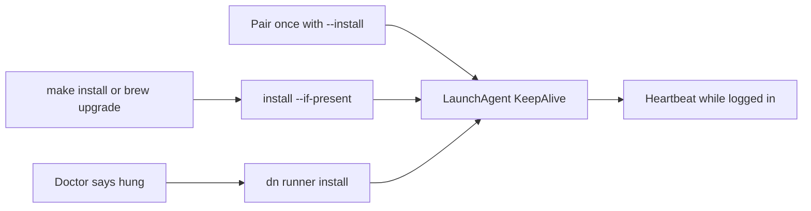
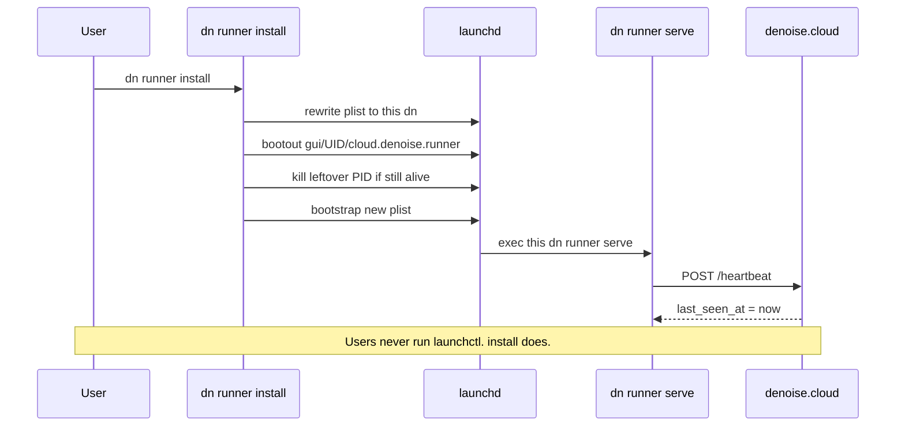

# Developer device runners

Use a device runner to run denoise kickstart jobs on an existing macOS or Linux
checkout. The runner uses the machine's installed agent, existing logins, Docker
daemon, and compute. Source code, local checkout paths, GitHub credentials, and
agent credentials stay on the device.

Device runners are owner-only in protocol v1. They accept kickstart jobs,
**land** jobs (`dn land` on the paired checkout), **sync** jobs (`dn sync` on
the paired checkout; trunk quality gate), denoise-task jobs, and **task-sync**
(Void ↔ `~/.dn/tasks/` relay), not arbitrary commands or GitHub Actions
workflows.

The close-out verbs match the denoise task dialog: Kickstart → Land → Sync →
Done. See denoise-docs **Kickstart, land, sync, and done** (`/close-out/`). Void
**task-sync** is unrelated to trunk `dn sync`.

## Local task sync (Void free plan)

Denoise does not store free-plan task bodies long-term. When The Void creates or
edits a ticketless task, denoise relays a short-lived envelope to the paired
runner. `dn runner serve` writes `DenoiseTaskDocument` JSON under
`~/.dn/tasks/<id>.json` on the laptop. Listing tasks from the browser long-polls
until the runner attaches a snapshot on the next heartbeat.

This is **not** `dn todo` / `~/.dn/todo.md`. Todo remains the GitHub-issue and
plan-path kickstart queue (`dn tidy`, `dn peek`, `dn todo done`). Local tasks
are portable documents for ticketless Void work and `denoise-task` kickstart.

```bash
# Inspect device-local tasks (no network)
dn task list
dn task show <id> --json
dn task upsert --file task.json
dn task delete <id>

# Run kickstart from a local document
dn kickstart --denoise-task ~/.dn/tasks/<id>.json --publish none
```

Owner session APIs (cookie auth):

```bash
POST /api/runners/tasks   # { runner_id, op: "upsert"|"delete", task_document?|task_id }
GET  /api/runners/tasks?runner_id=<id>   # long-poll device snapshot
```

Heartbeat responses include `pending_task_ops` and `list_tasks_requested`. The
runner ACKs applied envelopes with `task_sync_acks` and may attach `task_list`.

## Before you connect

The device needs:

- macOS or Linux
- `dn` on `PATH`
- at least one supported agent: OpenCode, Cursor, Claude Code, Codex, or GitHub
  Copilot CLI
- an existing GitHub checkout with an `origin` or Sapling `default` remote
- outbound HTTPS access to denoise

Run the service as your normal login user. Do not install or run it as root.

## Connect the device

1. Open **Settings > Runners** in denoise and create a pairing code.
2. Run the displayed command:

   ```bash
   dn runner connect <code> --install --name "Alex's MacBook Pro"
   ```

3. Approve the device in the browser.
4. Register a checkout from its repository root:

   ```bash
   cd ~/src/project
   dn runner register
   ```

   Registration asks for an explicit trust confirmation. For unattended setup,
   inspect the checkout first, then pass `--yes`.

5. Check readiness:

   ```bash
   dn runner doctor
   dn runner status
   ```

`--install` creates a user service. On macOS it installs
`~/Library/LaunchAgents/cloud.denoise.runner.plist`. On Linux it installs
`~/.config/systemd/user/denoise-runner.service`. Pairing stores a credential;
denoise stays offline until a `dn runner serve` loop heartbeats. The user
service is that same outbound loop. Denoise does not open an inbound port.

### User service vs foreground serve

Use the launchd or systemd user service for everyday pairing:

- You ran `dn runner connect <code> --install` or later `dn runner install`
- You are logged into a macOS GUI session (`gui/$UID`) or a Linux user session
- `dn runner doctor` reports the service check OK and `dn runner status` shows
  the device ready

Run `dn runner serve` in a terminal only when:

- You paired without `--install` and never installed the service
- You want live stdout for diagnostics
- The user service stopped (expired credential, bootstrap failure) and you are
  debugging it

Do not run both. `dn runner serve` refuses to start when the user service is
already running. Stop it first:

```bash
dn runner stop
dn runner serve
```

Bring the user service back with `dn runner start`. Upgrading `dn` with
`make install` or `brew upgrade` refreshes an already-installed user service to
this binary. You do not run `dn runner install` after every upgrade. Credential
rejection exits 0 so launchd/systemd do not tight-loop; re-pair and install to
come back online.

`dn runner doctor` asks Denoise whether it has a recent heartbeat, and it also
checks that the LaunchAgent is still making serve-loop progress. A running PID
is not enough. If doctor reports a hung or stale agent, recover with:

```bash
dn runner install
```

That rewrites the LaunchAgent to this `dn`, unloads the old job, kills a
leftover PID if launchd left it, and starts a new serve loop. Pairing is
unchanged. Re-pair only when doctor reports that Denoise rejected the
credential. Refresh status in the browser does not contact the laptop.





## Dispatch kickstart

In denoise, select the named device as the kickstart destination. The catalog
row has `provider: "device"`, `source: "device_runner"`, and the opaque
`runner_id`. GitHub Actions and exe.dev are other providers in the same catalog.

Agents and scripts can queue the same job from the device:

```bash
dn runner kickstart 213
dn runner kickstart https://github.com/owner/repo/issues/213 --wait
dn runner kickstart 213 --publish pr --json
dn runner kickstart 213 --publish none --json
```

Numeric issue references use the current checkout. A full issue URL must match
an explicitly registered repository. Issue-backed protocol jobs may leave work
local (`--publish none`) so you can `dn land` then `dn sync` from denoise or the
CLI, or open a pull request (`--publish pr`). GitHub Actions and hosted VMs stay
PR-only. Denoise-task jobs may use `publish: none` (default when queueing via
`--denoise-task`) when there is no GitHub issue to open a PR against.

Queue a denoise-task job (ticketless) from a local JSON file:

```bash
dn runner kickstart --denoise-task task.json
dn runner kickstart --denoise-task task.json --publish none --wait --json
```

The `--denoise-task` flag reads a `DenoiseTaskDocument` JSON file (schema v1:
`id`, `title`, `body`, `status`, `updated_at`, optional `repo_hint` /
`acceptance_criteria` / `tags`), sends it inline to the denoise API, and the
paired runner materializes it into plan-compatible markdown before executing
`dn kickstart`. Progress events for these jobs include `task_id`.

An offline runner can retain a job in the denoise queue for up to 24 hours.
Denoise does not move that job to paid hosted infrastructure. The outbound
long-poll loop claims one job when the runner reconnects.

## Operate the runner

The command surface is stable for people and automation:

```bash
dn runner status [--json]
dn runner jobs [--json]
dn runner doctor [--json]
dn runner install
dn runner start
dn runner stop
dn runner pause [--json]
dn runner resume [--json]
dn runner rotate [--json]
dn runner unregister owner/repo [--json]
dn runner disconnect [--json]
```

`install` is the user command that replaces a running LaunchAgent with this
`dn`. It rewrites the unit file, unloads the old job by service label, kills a
leftover PID if launchd left one, and starts a new serve loop. `start` does the
same replace without rewriting the file. `stop` only unloads, so you can run a
foreground `dn runner serve`. Users should not run `launchctl` directly.

Pause prevents new claims without revoking the device. Rotate replaces the
runner-scoped credential and invalidates the old value. Disconnect revokes the
credential immediately, stops the user service, and removes the local credential
file. It does not delete registered checkouts.

Local runner state lives under `~/.dn/runner/`:

- `credential.json` contains the expiring runner credential.
- `config.json` maps repository slugs to local checkout paths.
- `loop.alive` is written after each successful heartbeat, claim, or lease
  renewal. `dn runner doctor` treats a running LaunchAgent whose stamp is stale
  as a hung serve loop.
- `runner.log` and `runner.error.log` contain launchd service output on macOS.

Local Void task documents (task-sync) live under `~/.dn/tasks/<id>.json`,
separate from the GitHub/plan queue at `~/.dn/todo.md`.

The directory uses mode `0700`; credential and configuration files use mode
`0600`.

## Understand the security boundary

A device runner executes issue-driven code as your logged-in user. Register only
repositories you trust. Use the [Docker sandbox](sandbox.md) when a repository
or its issue content is untrusted.

The runner applies these boundaries:

- It makes outbound authenticated HTTPS requests. No inbound port is opened.
- Pairing requires signed-in browser approval. The server stores only a hash of
  the expiring runner credential and supports rotation and immediate revocation.
- Jobs contain a typed kickstart, land, sync, or denoise-task operation. The
  runner constructs the exact local command
  (`dn kickstart --sandbox none --publish …`,
  `dn --unattended --agent <harness> land [plan_file]`, or
  `dn --unattended sync`) and rejects argv, shell, environment, and workflow
  definitions. `--sandbox none` keeps ticketless denoise-task jobs runnable on
  devices whose repo config prefers `exe.dev`. Land jobs never receive local
  filesystem paths; `plan_file` is repo-relative (`plans/*.plan.md`) or omitted
  so `dn land` picks the newest plan. Sync jobs never pass `--skip-preflight`.
- The issue URL must belong to the registered repository. Local paths never
  enter heartbeat, job, or progress payloads.
- GitHub and agent authentication come from the local machine. Denoise does not
  send those credentials to the runner.
- Existing progress redaction removes recognizable credentials before events
  leave `dn`, and the runner caps forwarded events.
- Lease renewal carries cancellation state. Cancellation sends `SIGTERM`, waits
  for a bounded grace period, then uses `SIGKILL` if needed.
- Lease loss interrupts the child process. Denoise requires an explicit retry
  instead of automatically rerunning work that may already have created a branch
  or pull request.

The completion receipt can include the device, selected agent, duration, pull
request URL, local compute minutes, and one hosted run avoided. It does not
estimate dollar savings.

## Diagnose readiness

`dn runner doctor` checks the platform, pairing expiration, installed harnesses,
every registered checkout, and whether a serve loop is running. It reports
repository slugs, not paths, in JSON output. Doctor fails when no loop is
running, which is the same condition that makes denoise show the device offline.

For foreground logs, stop the user service first so two loops do not race:

```bash
dn runner stop
dn runner serve
```

The serve loop prints timestamped status lines on stdout when it is ready, when
a long-poll returns no work, when it claims a job, when kickstart phases start
or finish, when a job is cancelled or interrupted, when a job succeeds or fails,
and when it is paused. After an empty claim it waits about 2.5 seconds before
polling again, but it only reprints an idle line about every five minutes.
Example ready and idle lines:

```text
[2026-08-07T19:55:00.000Z] Runner ready; accepting work as runner-1 (codex, opencode; docker; 2 repos)
[2026-08-07T19:55:00.000Z] No work available; waiting for jobs
```

While a job runs, the same stream records identity, spawn, phase, and outcome
(child `[dn]` / agent output still appears unprefixed on stdout):

```text
[2026-08-07T19:55:00.000Z] Claimed job job-1 (kickstart, codex, publish=pr) chesapeakedev/dn#213
[2026-08-07T19:55:00.000Z] Starting job job-1 in /Users/you/src/dn: dn --unattended --agent codex kickstart --sandbox none --publish pr https://github.com/chesapeakedev/dn/issues/213
[2026-08-07T19:55:01.000Z] Job job-1 plan started: Plan phase started
[2026-08-07T19:58:00.000Z] Job job-1 succeeded (12m 4s, https://github.com/chesapeakedev/dn/pull/214)
[2026-08-07T19:58:00.000Z] Job job-2 failed (5s): dn kickstart exited with code 1. …
```

Device-runner jobs always invoke kickstart with `--sandbox none` so ticketless
denoise-task work is not blocked by a repo `exe.dev` sandbox config (exe.dev
requires a GitHub issue and `--publish pr`). Use local Docker sandboxing for
untrusted issue content when running kickstart interactively.

For the installed service:

```bash
# macOS
tail -f ~/.dn/runner/runner.log
tail -f ~/.dn/runner/runner.error.log

# Linux
journalctl --user -u denoise-runner.service -f
```

Re-pairing with `dn runner connect` stops the existing user service before
credential exchange, then starts it again when `--install` is set **or** when a
service unit was already present. `disconnect` and `rotate` use the same
stop-before-revoke ordering. On macOS the LaunchAgent sets `HOME`, restarts only
after unsuccessful exits (`KeepAlive.SuccessfulExit=false`), and applies a 10s
`ThrottleInterval`. Permanent credential rejection exits successfully so the
supervisor does not tight-loop.

Unsupported protocol responses include the server's minimum required version.
Upgrade `dn` (`make install` or `brew upgrade` refreshes the user service). If
the device stays offline, run `dn runner doctor` and `dn runner install`.

## Advanced GitHub Actions alternative

A self-hosted GitHub Actions runner remains available when a repository needs
arbitrary Actions workflows, runner groups, or GitHub's native runner controls.
That setup does not reuse the denoise device protocol or its typed job boundary.
See
[Self-hosted GitHub Actions runner setup](self-hosted/self-hosted-runner-setup.md).
