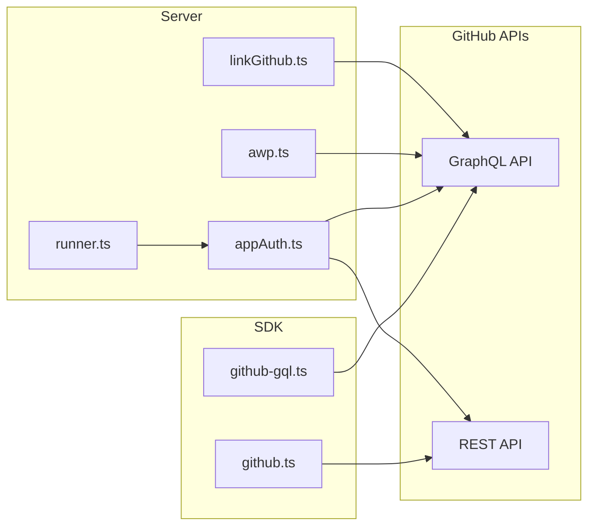

# Replace urql with obsidian-gql and standardize on GraphQL

## Current state

**urql usage (SDK only):**

- All urql usage is in [sdk/github/github-gql.ts](sdk/github/github-gql.ts): `Client`, `cacheExchange`, `fetchExchange`, `authExchange`, `gql`. The file is ~600 lines and implements:
  - GitHub GraphQL endpoint with **POST-only** (`preferGetMethod: false`)
  - **Auth**: `authExchange` adds `Authorization: Bearer <token>` and `User-Agent`, and implements `didAuthError` (401/403, GraphQL auth keywords), `refreshAuth` (throws for GitHub), `willAuthError`
  - **Queries**: repository info, issues (paginated), commits (paginated), single issue, single PR — all use **variables** (e.g. `$owner`, `$name`, `$number`)
  - Workarounds for urql’s exchange-auth bug (destructuring `authState`)

**REST vs GraphQL today:**

| Location                                                                       | Current                                                                   | Can move to GraphQL?                                                                                         |
| ------------------------------------------------------------------------------ | ------------------------------------------------------------------------- | ------------------------------------------------------------------------------------------------------------ |
| [sdk/github/github-gql.ts](sdk/github/github-gql.ts)                           | GraphQL (urql)                                                            | Yes — same operations, new client                                                                            |
| [sdk/github/github.ts](sdk/github/github.ts)                                   | REST `POST .../pulls` (createDraftPR)                                     | Yes — `createPullRequest` + `convertPullRequestToDraft`                                                      |
| [server/github/appAuth.ts](server/github/appAuth.ts)                           | REST for **App JWT + installation token + list installations**            | **No** — GitHub has no GraphQL for these                                                                     |
| [server/github/appAuth.ts](server/github/appAuth.ts) `GitHubRestClient`        | REST: getIssue, getRepo, createIssueComment, createPullRequest, addLabels | Yes — GraphQL: `repository.issue`, `repository`, `addComment`, `createPullRequest`, `addLabelsToLabelable`   |
| [sdk/auth/github.ts](sdk/auth/github.ts)                                       | REST: OAuth token exchange, `GET /user`                                   | Token exchange **must** stay REST. User profile: optional GraphQL `viewer { login, avatarUrl, name, email }` |
| [server/discord/commands/awp.ts](server/discord/commands/awp.ts)               | REST `GET .../teams/.../memberships/...`                                  | Yes — GraphQL `Organization.team.members` / membership                                                       |
| [server/discord/commands/linkGithub.ts](server/discord/commands/linkGithub.ts) | REST `GET .../users/.../gists`                                            | Yes — GraphQL `user(login).gists`                                                                            |

**Must remain REST:** GitHub App auth (JWT, installation token, list installations), OAuth token exchange.

---

## obsidian-gql client (0.2.0)

- **Exports**: `ObsidianRouter` (server), `ObsidianClient` (client), `gql`.
- **ObsidianClient**: `new ObsidianClient({ endpoint, headers, useCache, algo, capacity, ... })`; `client.query(query, options)`; `client.mutate(mutation, options)`.
- **Options**: `headers` (default or per-request), `cacheRead`, `cacheWrite`, `endpoint`, `variables` (for queries/mutations).
- **Request shape**: Uses **POST** only; body includes `query` and `variables` (when provided) per GraphQL spec.
- **Auth**: Set `Authorization` and `User-Agent` headers via `headers` option (default or per-request). Handle auth errors by checking `result.errors` and HTTP status codes.

**All gaps resolved in 0.2.0:** Variable support, header configuration, POST-only requests, standard GraphQL response shape.

---

## Implementation plan

### Phase 1: Replace urql in SDK with obsidian-gql

- **sdk/deno.json**: Remove `@urql/core` and `@urql/exchange-auth`; update `@chesapeake/obsidian-gql` to `^0.2.0` (already at `^0.2.0` in root [deno.json](deno.json)).
- **sdk/github/github-gql.ts**:
  - Import `ObsidianClient` and `gql` from `@chesapeake/obsidian-gql`.
  - Create client with `endpoint: "https://api.github.com/graphql"`, `headers: { Authorization: "Bearer ...", "User-Agent": "dn-github-graphql" }`. Token from `getGitHubToken()` (unchanged).
  - Create client per call or a module-level getter (no auth refresh; same as today).
  - Replace `client.query(QUERY, vars, { requestPolicy: "network-only" }).toPromise()` with obsidian-gql `client.query(queryDocument, { variables: vars, cacheRead: false, cacheWrite: false })`. Use `gql` from obsidian-gql for document strings (or keep as template literals if `gql` is just a tag).
  - Keep all existing GraphQL documents and types; only the client and call shape change.
  - Remove authExchange; add a small helper that checks `result.errors` and HTTP status (if exposed) and throws with the same user-facing messages (SSO, token scope, etc.). No retry/refresh.
  - Remove workarounds for urql’s exchange-auth bug.
  - Handle response shape: obsidian-gql returns `{ data?, errors? }` directly (no `.toPromise()` wrapper).

### Phase 2: Standardize GitHub on GraphQL where possible

- **sdk/github/github.ts** (`createDraftPR`): Switch to GraphQL: `createPullRequest` mutation then `convertPullRequestToDraft` mutation. Use the same ObsidianClient (with token). Keep `getCurrentRepoFromRemote` and `getDefaultBranch` (already GraphQL).
- **server/github/appAuth.ts**:
  - **Keep REST**: `getInstallationToken`, `listInstallations` (no GraphQL).
  - **Replace `GitHubRestClient**` with a GraphQL-based implementation: get issue, repo, add comment, create PR, add labels via GitHub GraphQL (same mutations/queries as docs). Use installation token in ObsidianClient headers. Implement the same interface so [server/jobs/runner.ts](server/jobs/runner.ts) does not need structural changes.
- **server/discord/commands/awp.ts**: Replace team membership REST call with GraphQL (e.g. `Organization.team` / membership query).
- **server/discord/commands/linkGithub.ts**: Replace gists REST call with GraphQL `user(login).gists`.
- **sdk/auth/github.ts**: Keep OAuth token exchange as REST. Optionally replace `getGitHubUser` with a GraphQL `viewer` query using the access token (same client pattern as above).

### Phase 3: Remove urql from workspace

- Root [deno.json](deno.json): Remove `@urql/core` and `@urql/exchange-auth`.
- Grep for any remaining `urql` references and remove.

### Phase 4: Tests and docs

- Run existing tests; fix any that depended on urql or REST shape.
- Add a short note (e.g. in [sdk/github/README](sdk/github/) or main README) that GitHub is accessed via GraphQL except for App auth and OAuth token exchange, and that obsidian-gql is the client.

---

## Architecture diagram

After changes: `githubRest` and `appAuth` REST client use GraphQL where possible; only App JWT/token/list and OAuth exchange stay on REST.

---

## Summary

- **Replace urql** in [sdk/github/github-gql.ts](sdk/github/github-gql.ts) with **[obsidian-gql@0.2.0](mailto:obsidian-gql@0.2.0)** `ObsidianClient`; use `variables` option for queries/mutations, set auth headers via `headers` option.
- **Standardize on GraphQL** for: create PR (SDK + server), server’s get issue/repo/comment/PR/labels, team membership, gists; optionally viewer for OAuth user.
- **Keep REST** for: GitHub App JWT, installation token, list installations; OAuth token exchange.
- **obsidian-gql 0.2.0** includes all required features: variable support, header configuration, POST-only requests, standard GraphQL response shape.

